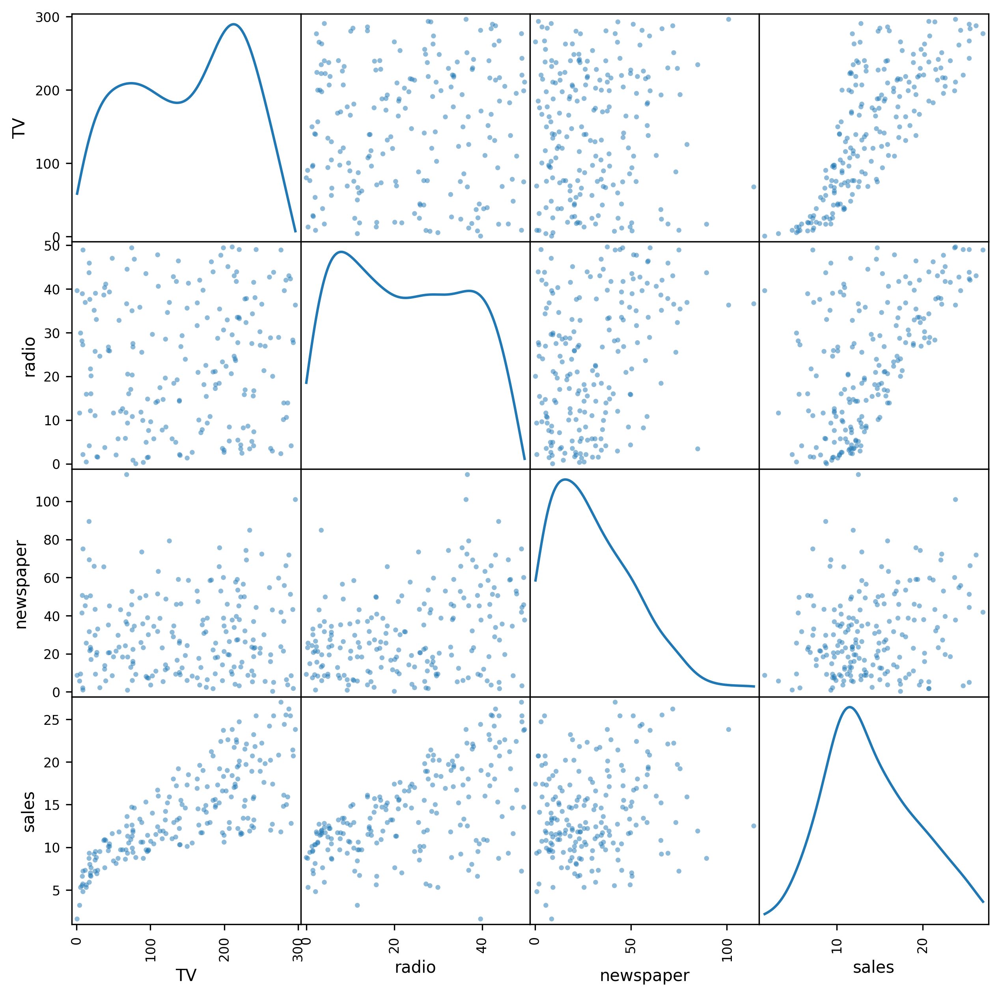

# Auto Dataset Analysis

Exploratory analysis of the ISLR/ISLP `Advertising` dataset with only three quantitative variables.  
Key focus: understanding the interaction between advertising types and their impact on sales.  Though the features are not particularly well-correlated, it is interesting to check what is the minimal amount of information required to predict sales.  Each record corresponds to a campaign with some amount of spending on TV, radio, and newspaper advertising.

Google Colab notebook:  [3_Advertising](notebooks/3_Advertising.ipynb)

## Quick Look



## Highlights
- TV is most highly correlated with sales, followed by radio, then by newspaper.  Radio and newspaper have a correlation coefficient of 0.35, higher than that of the 0.23 between newspaper and sales.
- Taken individually, the highest $\beta_1$ is for radio, at 0.202.  At 200 records, this finding results in a very high t-statistic, rejecting a null hypothesis of $\beta_1 = 0$.
- Taken together, the variable with the maximum p-value is newspaper spending, so it is natural to perform Forward Selection and pull this variable out of consideration.  After doing so, the F-statistic increases from 570.3 to 859.6.  The F-statistic indicates the confidence of at least one of the remaining variables being significant in predicting sales.  The $R^2$ remained nearly the same, meaning the variation in the prediction was still largely explained by the remaining two variables, radio and TV spending.
- Adding an interaction term $X_1 \times X_2$ (product of TV and radio spending) increased $R^2$ from 0.87 to 0.97, helping to explain more of the variation in the model.
- However, this interaction term introduces explicit multicollinearity which can be associated with overfitting.  We expect adding an interaction term to increase Variance Inflation Factors (VIFs), but the highest one only hits 6.947, a moderate amount.  If any or all of the VIFs showed to be over 10, that would show a strong risk of overfitting, for which Lasso or Ridge regression might be needed.

## Implementation Details
- The numeric column in `Advertising.csv` is not labeled, so it was named `CampaignID`.
- The correlation coefficients in the correlation matrix are all positive, so the heatmap needed a modification to plot from `vmin = -1.0` to `vmax = 1.0`.
- To compute VIFs, we run a loop to run OLS across potential features to regress on.

## Feature Importances
- [Correlation Heatmap](figures/upper_corr_matrix.png)
- [TV Advertising on Sales](figures/TV Advertising on Sales.png)
- [Radio_Advertising_on_Sales](figures/Radio_Advertising_on_Sales.png)
- [Newspaper_Advertising_on_Sales](figures/Newspaper_Advertising_on_Sales.png)


## Requirements

Use the below command in a terminal or notebook environment such as bash, Jupyter, or Colab:

```bash
pip install -r requirements.txt
