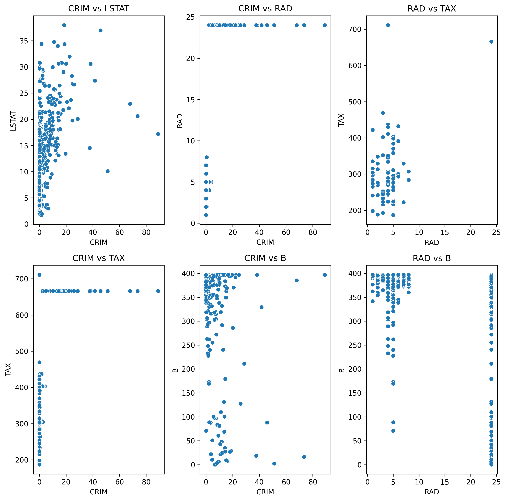

# Boston Housing Dataset Analysis

Exploratory analysis of the ISLR/ISLP `Boston` dataset with quantitatively-labeled categorical variables. 
Key focus: Although it might be traditional to use features to predict Median Home Value (MEDV), this study will focus on using the features to predict per-capita crime rate (CRIM).  Some features are well-correlated, and many records tend to cluster onto exact points.

Google Colab notebook:  [E2_10](notebooks/E2_10.ipynb)

## Quick Look



## Highlights
- Found heavy correlation between cylinders (number of cylinders), displacement (engine size, broadly speaking), horsepower, and weight.  These are anticorrelated with mpg and acceleration.
- Mpg is somewhat positively correlated with year, indicating potential technological advancement.
- Mpg is generally lower for American cars in aggregate, but also lower mpg when looking at the manufacturer level.
- OLS performs relatively well for predicting Mpg on American cars from quantitative features.  Most important features appear to be weight and year, across regions.
- Sparse analysis through Lasso shows similar important features.  Acceleration is much less predictive of mpg.
- Random forest with qualitative Origin variable attached shows origin not at all a driver of mpg.

## Implementation Details
- Headers are absent from the original dataset, but they are added as follows: \
    CRIM - per capita crime rate by town \
    ZN - proportion of residential land zoned for lots over 25,000 sq.ft. \
    INDUS - proportion of non-retail business acres per town. \
    CHAS - Charles River dummy variable (1 if tract bounds river; 0 otherwise) \
    NOX - nitric oxides concentration (parts per 10 million) \
    RM - average number of rooms per dwelling \
    AGE - proportion of owner-occupied units built prior to 1940 \
    DIS - weighted distances to five Boston employment centers \
    RAD - index of accessibility to radial highways \
    TAX - full-value property-tax rate per $10,000 \
    PTRATIO - pupil-teacher ratio by town \
    B - 1000(Bk - 0.63)^2 where Bk is the proportion of black people by town \
    LSTAT - percent lower status of the population \
    MEDV - Median value of owner-occupied homes in $1000's
- Many cars with the same name are featured in different years; a couple with the same name are featured in the same year.  Each entry has remarkably different specifications, so they are treated as different data points, though names are updated to distinguish them on identification.
- Company names are extracted from names of cars for EDA; some company names are spelled incorrectly and need to be fixed.  Company names were fixed by hand.
- Lasso is performed with alpha = 0.2, a moderately high regularization parameter.  This was required due to a high degree of correlation between features.  The resulting model helped to identify important features but will have more natural bias than the OLS model.
- To implement the Random Forest regressor in scikit-learn (sklearn), the categorial variable for Origin needs to be replaced with a one-hot encoding.  That is, the three possibilities are spread out over three binary columns that are treated as separate features.  It will be interesting to know if there is a way to avoid the process of one-hot encoding, as there is a natural correlation between the resulting features.

## Feature Importances
- [OLS Performance](figures/OLSErr.csv)
- [OLS Importances](figures/OLSImportances.csv)
- [Lasso Performance](figures/LassoErr.csv)
- [Lasso Importances](figures/LassoImportances.csv)
- [Random Forest Importances](figures/RFImportances.csv)


## Requirements

Use the below command in a terminal or notebook environment such as bash, Jupyter, or Colab:

```bash
pip install -r requirements.txt
