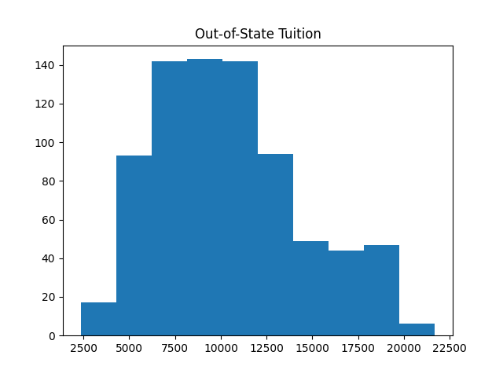

# College Dataset Analysis

Exploratory analysis of the ISLR/ISLP `College` dataset.  
Key focus: understanding differences in Outstate Tuition between private and public institutions, relative to other predictors.

Google Colab notebook:  [E2_8](notebooks/E2_8.ipynb)

## Quick Look



## Highlights
- Created a new variable `Elite` using `pd.cut`.
- Visualized Out-of-State tuition by `Private`/`Public` status.
- Compared distributions of Room & Board, Personal, and Books expenses.
- Compared important features for predicting Outstate Tuition for Private and Non-Private schools using OLS and Lasso.
- Determined importance of Private School Status relative to other features for Outstate Tuition using Random Forest and Lasso.

## Implementation Details
- The variable 'Private' is a categorical indicator, i.e. each record is Yes or No for this variable.  The rest are numerical.
- Preprocess categorical features through a one-hot encoding, as they are unordered.
- Linear regression and neural nets rely on all variables being numerical, so the one-hot encoding is required to incorporate this variable.
- Preprocess numerical features by normalizing if using distance-based or gradient-based methods.
- Often useful to group records by categorical value and analyze separately first, then think about how to combine for modeling.
- Tree-based methods like Random Forests can handle the mixed data directly without a need for the one-hot encoding.

## Feature Importances
- [Metrics Table 1](figures/metrics_df.csv)
- [Metrics Table 2](figures/metrics_df2.csv)
- [Metrics Table 3](figures/metrics_df3.csv)
- [Feature Importances Split](figures/feature_split_df.csv)
- [Elastic Net Importances](figures/feature_split_enet.csv)
- [Combined Feature Importances](figures/feature_combined.csv)


## Requirements

Use the below command in a terminal or notebook environment such as bash, Jupyter, or Colab:

```bash
pip install -r requirements.txt
